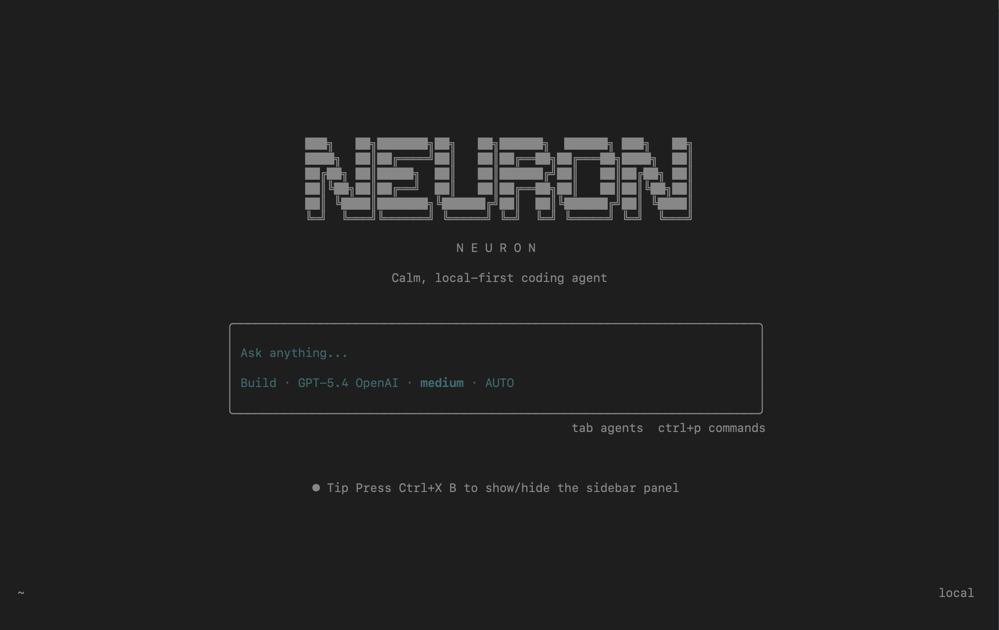

<p align="center">
  
</p>

<h1 align="center">NEURON</h1>
<p align="center"><strong>Calm, local-first coding agent for serious engineering work.</strong></p>
<p align="center">
  Neuron is a terminal-first AI agent built for shipping code, exploring large codebases, designing polished interfaces,
  orchestrating multi-step workflows, and staying deeply customizable.
</p>

---

## Why Neuron

Neuron is not just another chat wrapper for shell commands. It is built to act like a real software teammate:

- It understands large codebases, not just single files.
- It can plan, execute, and verify multi-step engineering work.
- It is strong at both coding and interface design.
- It is local-first, highly customizable, and provider-agnostic.
- It is open-source and repo-owned, so you are not locked into one company or one model.

If you want a CLI agent that feels fast, flexible, and deeply hackable, this is what Neuron is for.

## What Makes Neuron Stand Out

### Better for open engineering workflows

- Fully open-source core
- Provider-agnostic model support
- Terminal-first workflow with web and desktop clients on top
- Local project memory and workspace-specific agent behavior
- Custom commands, themes, agents, tools, and plugins from the repo itself

### Better for serious coding work

- Multi-step agentic execution instead of one-shot file edits
- Subagents for parallel and specialized task execution
- Built-in MCP support for external tools, services, prompts, and resources
- Strong codebase exploration through search, LSP, snapshots, and structured tool usage
- Readable action transparency inside the TUI while work is running

### Better for design-heavy work

- Custom Neuron theme and terminal UI workflow
- Strong support for frontend iteration, design polish, and UI review flows
- Skills that help with layout, visual quality, redesigns, and component work
- A setup that works for both engineering-heavy and product-design-heavy repos

## Why Teams May Prefer Neuron Over Claude Code

Claude Code is excellent, but Neuron has real advantages in a few areas:

- Open-source instead of closed product infrastructure
- Cross-provider instead of single-vendor default thinking
- Cross-skill compatibility with Neuron skills, Claude Code skills, and OpenClaw skills
- Native workspace memory files and bootstrap onboarding flow
- Deep repo customization through `.neuron/` project config
- Terminal-first UI with custom theming, execution modes, and command palette workflows
- Easier repo ownership if you want to fork, rebrand, or adapt the product to your own team

This is not about hype. It is about control, extensibility, and owning your workflow.

## Comparison

| Capability | Neuron | Claude Code | Codex CLI |
| --- | --- | --- | --- |
| **Open-source core** | ✅ Full | ❌ No | ❌ No |
| **Local-first terminal experience** | ⭐ Excellent | ⭐ Good | ⭐ Good |
| **Deep visual design workflow** | ⭐ Excellent | ⭐ Good | ⭐ Fair |
| **Cross-provider flexibility** | ✅ Multiple providers | ❌ Claude only | ❌ Limited |
| **Workspace memory & bootstrap** | ✅ Built-in | ⚠️ Limited | ⚠️ Limited |
| **Project customization (`.neuron/`)** | ✅ Yes | ❌ No | ❌ No |
| **Execution modes (SAFE/SMART/AUTO)** | ✅ Full | ⚠️ Partial | ⚠️ Partial |
| **Multi-provider skills** | ✅ Neuron + Claude + OpenClaw | ⚠️ Claude only | ❌ Limited |
| **Fork-and-own capability** | ✅ Complete | ❌ No | ❌ No |
| **Custom themes & terminal UI** | ✅ Yes | ⚠️ Limited | ⚠️ Limited |
| **Team collaboration features** | ✅ Yes | ⭐ Strong | ⭐ Good |
| **MCP support** | ✅ Native | ⚠️ Partial | ⚠️ Partial |

**For teams that want control, portability, and a powerful open-source alternative:** Neuron is the clear winner.

## Quick Start

### Install Neuron CLI

Install from GitHub:

```bash
curl -fsSL https://raw.githubusercontent.com/Marwan78888/Neuron-Cli/main/install.sh | bash
```

Start Neuron in your current directory:

```bash
neuron start
```

Launch it against a specific project:

```bash
neuron start /path/to/project
```

Or set a default project path:

```bash
export NEURON_PROJECT_PATH="/path/to/your/projects"
neuron start
```

## Development From Source

From the project root:

```bash
bun install
bun dev .
```

Useful development commands:

```bash
bun dev .                 # run the Neuron terminal UI in this repo
bun run dev:web           # run the web app
bun run dev:desktop       # run the desktop app
neuron start              # run from the published launcher
```

## Core Commands

Neuron exposes a full CLI, not just the interactive TUI:

```bash
neuron start             # open the TUI in the current directory
neuron run               # non-interactive agent run
neuron serve             # headless API server
neuron web               # server + web interface
neuron mcp               # manage MCP servers
neuron skill             # list or import skills
neuron agent             # manage agents
neuron session           # manage sessions
neuron export            # export sessions
neuron import            # import sessions
neuron github            # GitHub agent workflows
neuron pr <number>       # checkout a PR and continue work there
```

## TUI Workflow

Inside the terminal UI:

- `Ctrl+P` opens the command palette
- `Tab` switches agents
- `/mode` opens execution mode selection
- `/safe`, `/smart`, `/auto` switch execution modes directly
- `/search-provider` opens search provider settings

### Execution Modes

- `SAFE` keeps work read-only until you approve actions
- `SMART` explores first, then waits before mutating actions
- `AUTO` runs the normal autonomous workflow

### Action Transparency

While Neuron is working, the UI can show direct action lines such as:

- `→ Building website...`
- `→ Preparing deployment...`
- `→ Publishing to here.now...`

That makes long-running agent behavior easier to trust and easier to follow.

## Skills

Neuron supports reusable portable skills and can work across ecosystems:

- Native Neuron / Agents-style skills
- Claude Code skills
- OpenClaw skills

Examples:

```bash
neuron skill list
neuron skill import ~/.claude/skills/my-skill --ecosystem claude
neuron skill import ~/.openclaw/skills/my-skill --ecosystem openclaw
neuron skill import ./skills/my-skill --ecosystem agents
```

This makes Neuron especially strong if you already have a skills library from another coding-agent workflow.

## Search, Research, and Browser Workflows

Neuron supports configurable search workflows with:

- Perplexity
- Brave Search
- agent-browser skill integration

The TUI can store your preferred search provider and API key, then feed that context into the agent so web research stays consistent and workspace-aware.

## Bootstrap Memory System

Neuron can onboard itself on first run through a workspace bootstrap flow.

If `BOOTSTRAP.md` exists, Neuron starts there first. After onboarding, it uses files like:

- `AGENT.md`
- `USER.md`
- `MEMORY.md`
- `SOUL.md`

That means the assistant can remember:

- its chosen name
- its vibe and persona
- preferred emoji and style
- user preferences and boundaries

This gives Neuron a much more persistent and personal workspace identity than the usual stateless CLI experience.

## Support & Star the Project

If Neuron helps you ship code faster or makes your workflows happier, a star on GitHub keeps the project visible and helps other engineers discover it.

Please consider starring the repo:

[](https://github.com/Marwan78888/Neuron-Cli/stargazers)

Thank you — every star helps the project grow and reach more developers.

## `.neuron` Project Customization

Neuron prefers `.neuron` as the local project system directory.

Use it to store things like:

- custom agents
- custom commands
- local themes
- project tools
- plugins
- plans

This makes it easy to turn one repo into a highly specialized operating environment for your team.

## MCP and Extensibility

Neuron has first-class MCP support for:

- tools
- prompts
- resources
- remote servers
- local servers
- OAuth-enabled flows

If your workflow depends on external systems, MCP gives Neuron a clean way to connect them without turning your CLI into a mess of one-off scripts.

## Architecture

The repo is split into focused packages:

- **Neuron core** — CLI, server, TUI, sessions, tools, orchestration engine
- `packages/app` — shared web application UI
- `packages/desktop` — desktop shell and application wrapper
- `packages/plugin` — plugin system and extensibility
- `packages/sdk` — SDK pieces and external integrations

This modular architecture makes Neuron strong for both local terminal use and larger multi-client setups.

## Contributing

If you want to contribute, read [CONTRIBUTING.md](./CONTRIBUTING.md) first.

## Summary

Neuron is built for people who want:

- the speed of a terminal
- the depth of a real coding agent
- the flexibility of open tooling
- the polish to handle design work well
- the freedom to own and customize the whole stack

If you want one CLI that can code hard, design cleanly, remember context, reuse skills, and still stay hackable, Neuron is built for that.
